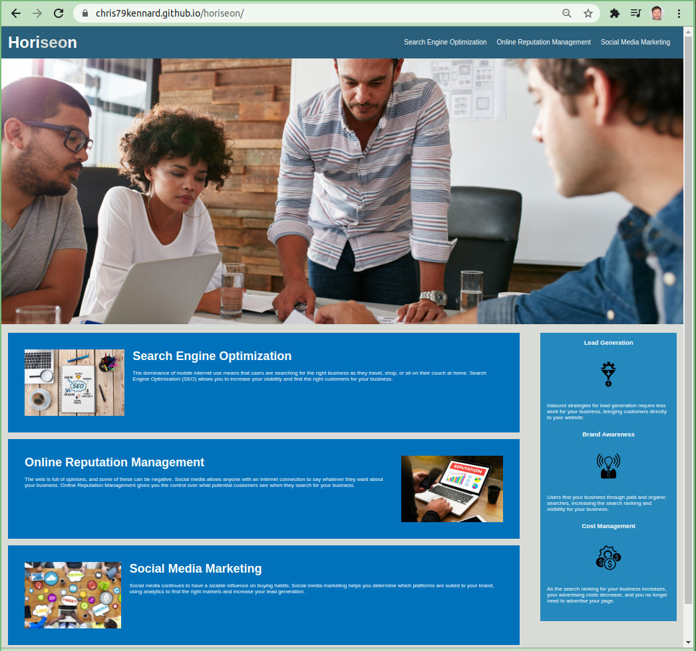

# Christopher Kennard's 1st home work assignment

## Task: Review the HTML and CSS on the file and make it more accessable for those with disabilties, with out changing the fuctionality of the site.

## Languages / Systems used to complete this assignment

1. Html
2. CSS
3. Git

### Changes Made:

- Added alt to image elements for accessability
- Added id to search engine optimization div for a href to work.
- Replaced all P tags and switched them with Articles for accessability
- reorginized the order of the CSS to match the HTML file
- updated title element
- removed four redundant classes in CSS and renamed a class to services and another

# screen shot

# links

- [deployed website](https://chris79kennard.github.io/horiseon/)
- [repository](https://github.com/chris79kennard/horiseon)
